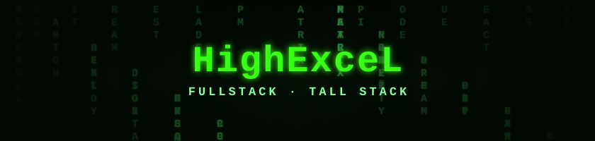

  

  

  <a href="https://highexcel.ru">highexcel.ru</a>
  ·
  <a href="mailto:highexcel@ya.ru">highexcel@ya.ru</a>
  ·
  <a href="https://t.me/HighExceL">@HighExceL</a>

## Технологии

  <code>Laravel</code>&nbsp;
  <code>Livewire</code>&nbsp;
  <code>Tailwind CSS</code>&nbsp;
  <code>Alpine.js</code>&nbsp;
  <code>PHP</code>&nbsp;
  <code>JavaScript</code>
    
  <code>MySQL</code>&nbsp;
  <code>PostgreSQL</code>&nbsp;
  <code>Redis</code>&nbsp;
  <code>Docker</code>&nbsp;
  <code>Nginx</code>&nbsp;
  <code>Linux</code>

## Активность

  <picture>
    <source media="(prefers-color-scheme: dark)" srcset="./assets/activity/github-contribution-grid-snake-dark.svg" />
    <source media="(prefers-color-scheme: light)" srcset="./assets/activity/github-contribution-grid-snake.svg" />
    
  </picture>

